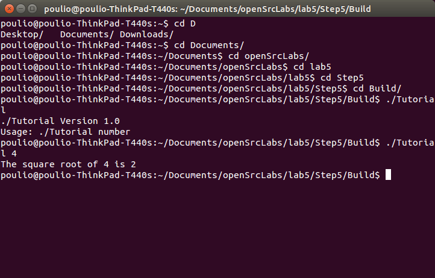

Step1: The square root of 4 is 2
Step2: The square root of 4 is 2 (same output but using my sqrt function)
Step3: 1/5 ... passed
...
...
5/5 ... passed
100% tests passed, 0 tests failed out of 5
Step4: same as above but uses log and exp
Step5: 
https://github.com/olivierpo/lab5
