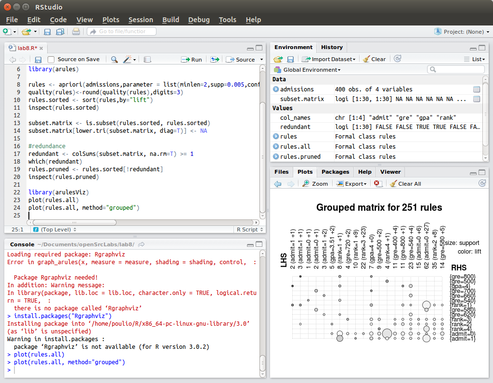

#Lab 8

My project is going well, we are just hashing out some problems with the algorithm to find the bombs. The rest, like scanning the memory to find the table and then parsing that information is all working as intended.
